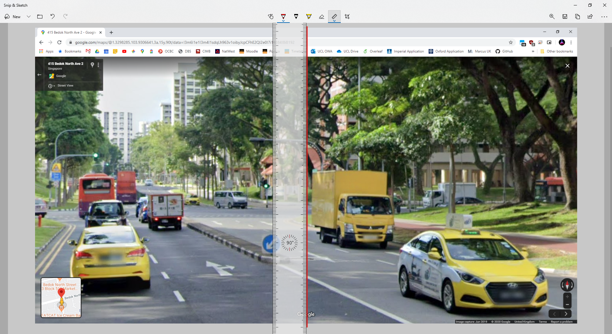

<html><head><meta content="text/html; charset=UTF-8" http-equiv="content-type"></head><body class="c15">

Solar Shading Modeller

User guide
<h1 class="c10 c2" id="h.ehx7q9uts426">Introduction</h1>
The function of this tool is to calculate the impact of shading on the solar energy received at a location. It requires a 360&deg; panorama (taken from Google StreetView) or a hemispherical fisheye image as input. It outputs a report which includes the percentage of energy lost to shading at the location analyzed, and the impact of shading for each month in the year.

<h1 class="c10 c2" id="h.qkdwp8skbuyn">Download and run</h1><ol class="c4 lst-kix_wcy63pfyokw9-0 start" start="1"><li class="c1 c9">The .zip file (around 280 MB) containing the program can be downloaded from:</li></ol>
<a class="c3" href="https://www.google.com/url?q=https://github.com/bowenfan96/solar-shading-modeller/releases&amp;sa=D&amp;ust=1582406735121000">https://github.com/bowenfan96/solar-shading-modeller/releases</a>

This page will be updated if there is a newer version of the program.
<ol class="c4 lst-kix_wcy63pfyokw9-0" start="2"><li class="c1 c9">Unzip the file and click &ldquo;ssm_v0.5.exe - Shortcut&rdquo; to launch the program.</li></ol><h2 class="c1 c2" id="h.c1b5inzt7s0">Interface</h2>

When launched, a command window will pop up together with the program window - don&rsquo;t close the command window or the program will also exit. The command window serves as a progress monitor during the calculation.
<h1 class="c10 c2" id="h.gv9wpnleonwv">Obtaining a 360&deg; panorama or a hemispherical fisheye</h1><h2 class="c1 c2" id="h.ard3wsn896s4">360&deg; panorama</h2>
The most convenient way to analyze the solar potential at a location is with a 360&deg; panorama from Google Maps StreetView. To do this, the location of interest has to be on a road that&rsquo;s covered by StreetView.
<ol class="c4 lst-kix_wcy63pfyokw9-0" start="3"><li class="c1 c9">Download the tool that stitches together StreetView imagery to give a 360&deg; panorama from this link: <a class="c3" href="https://www.google.com/url?q=https://svd360.istreetview.com/&amp;sa=D&amp;ust=1582406735124000">https://svd360.istreetview.com/</a>&nbsp; Credits to Thomas Orlita, who wrote this panorama downloader software.</li><li class="c1 c9">Go to <a class="c3" href="https://www.google.com/url?q=https://www.google.com/maps&amp;sa=D&amp;ust=1582406735124000">https://www.google.com/maps</a>&nbsp;and enter StreetView for a location of interest. Navigate as close as possible to a planned location for the solar panel.</li></ol>
As an example, I have navigated to an existing panel at 415 Bedok North Ave 2. With this method, the solar analysis will actually be giving results for the point on the road from which the StreetView was taken. This may be a couple of meters away from the real panel position. As such, it&rsquo;s important to get as close as possible.

<ol class="c4 lst-kix_wcy63pfyokw9-0" start="5"><li class="c1 c9">Copy the URL from the address bar. Paste this URL into the solar program and click &ldquo;Get Pano ID&rdquo;. Copy the Pano ID generated:</li></ol>

<ol class="c4 lst-kix_wcy63pfyokw9-0" start="6"><li class="c1 c9">Install and open the &nbsp;&ldquo;Street View Download 360&rdquo; tool from Step 3. Specify a save folder and the file name. Paste the Pano ID into the program as such:</li></ol>

A resolution of 1664&times;832 is sufficient. Higher resolutions are okay but the image tracing will take longer.
<ol class="c4 lst-kix_wcy63pfyokw9-0" start="7"><li class="c1 c9">Click &ldquo;Download Panorama&rdquo; and open the downloaded .png or .jpg in Paint 3D (standard software on Windows 10), like this: Should be able to just right click on the image file and select &ldquo;Edit with Paint 3D&rdquo;</li></ol>

The solar analysis tool assumes that North is aligned to the leftmost pixel on the image. Hence it is necessary to edit the panorama such as the North is on the left.
<ol class="c4 lst-kix_wcy63pfyokw9-0" start="8"><li class="c1 c9">Go back to Google Maps StreetView page. Click on the compass icon in the bottom-right corner so that the center of the picture aligns North (the red arrow should be pointing up).  It helps to zoom in first (scroll up), then align the compass - it&rsquo;s easier to find an object that&rsquo;s aligned to the North as they are bigger (see Step 9).</li></ol>

<ol class="c4 lst-kix_wcy63pfyokw9-0" start="9"><li class="c1 c9">Identify an object on the image that is directly along the North direction. This is any landmark or feature in the center of the view - the centerline is roughly in the middle of the 2nd &lsquo;o&rsquo; of the Google logo at the bottom.</li></ol>

Here, the centerline, which is the North, is slightly to the left of the lorry.
<ol class="c4 lst-kix_wcy63pfyokw9-0" start="10"><li class="c1 c9">Now we&rsquo;ll have to edit the panorama image in Paint 3D and shift this lorry to the left.</li></ol><ol class="c4 lst-kix_wcy63pfyokw9-1 start" start="1"><li class="c1 c13">Click &ldquo;Select&rdquo; from the top left corner. Draw a box to select the portion that contains the 0&deg; North line. Try to align it accurately.</li></ol>

To illustrate, this is the portion selected. Note that the lorry is on the the extreme left:

<ol class="c4 lst-kix_wcy63pfyokw9-1" start="2"><li class="c1 c13">Cut the selection (Ctrl-X):</li></ol>

<ol class="c4 lst-kix_wcy63pfyokw9-1" start="3"><li class="c1 c13">Select the other half:</li></ol>

<ol class="c4 lst-kix_wcy63pfyokw9-1" start="4"><li class="c1 c13">Move this selection to the right by dragging it after it is selected. Then, paste the previous selection and drag it so that it is aligned to the left. Try not to leave a gap between the two portions:</li></ol>

<ol class="c4 lst-kix_wcy63pfyokw9-1" start="5"><li class="c1 c13">This is what the image should look like now, after being pieced together. The left of the image is now aligned to the geographic North (note where the lorry is).</li></ol>

<ol class="c4 lst-kix_wcy63pfyokw9-1" start="6"><li class="c1 c13">Crop the image into half. This is because this is a 360&deg;&times;180&deg; panorama. The lower half is actually below the panel height.</li></ol>

Click &ldquo;Crop&rdquo; from the top left corner. Crop the height to half of its original - the original height was 1024 px, so now it&rsquo;s cropped to 512 px.
<ol class="c4 lst-kix_wcy63pfyokw9-1" start="7"><li class="c1 c13">Save the image (Ctrl-S). This is what you should have now:</li></ol>

<h1 class="c10 c2" id="h.fnkcz8w5m6kk">Running the analysis</h1><ol class="c4 lst-kix_wcy63pfyokw9-0" start="11"><li class="c1 c9">Go back to the solar analysis tool. Select the edited panorama in the &ldquo;Select image file&rdquo; row, using the &ldquo;browse&rdquo; button. Fill in the rest of the fields too.</li></ol>

<ol class="c4 lst-kix_wcy63pfyokw9-0" start="12"><li class="c1 c9">Click &ldquo;Test sensitivity&rdquo; to test whether the program is able to trace the obstacles accurately: (The higher the value, the less sensitive the program is. This may be confusing and I intend to fix this in a future release.)</li></ol>
The program will display the traced obstacles:

In this case, the default value of 350 works well - the trees and the HDBs are traced quite accurately. 

However, the program may have trouble identifying the obstacles if the sky is cloudy or if the buildings are too similar to the colour of the sky. 

In this case, it will be more accurate if you manually trace the obstacles with a red line and erase the sky before feeding it into the program:

In Paint 3D, use the red marker to draw over the trees and buildings, then use the eraser tool to erase the sky (don&rsquo;t erase the red marker line):

You should have an image like this:

<ol class="c4 lst-kix_wcy63pfyokw9-0" start="13"><li class="c1 c9">You can test the sensitivity multiple times, until the program traces all the obstacles accurately. If you manually trace the sky with a red line and erase the sky like illustrated above, the default sensitivity value of 350 should be accurate.</li><li class="c1 c9">Select a computation interval - the default value of 5 minutes means that the position of the sun is calculated and compared to the positions of the obstacles every 5 minutes.  Recommended to leave this as the default. A lower value (e.g. 1 minute) will take more time to compute, but does not increase accuracy because the accuracy bottleneck is with the image tracing.</li></ol>

<ol class="c4 lst-kix_wcy63pfyokw9-0" start="15"><li class="c1 c9">Click &ldquo;Compute&rdquo; to begin calculations:</li></ol>

The program will say &ldquo;Not Responding&rdquo;, but it is actually making a lot of calculations in the background - see the console window. Don&rsquo;t click the window repeatedly.

When it is done (about 1-2 minutes), the program will generate a report at the folder specified, and a window will pop up:

<h1 class="c10 c2" id="h.kq58ipajpbwv">Solar Report</h1><h2 class="c1 c2" id="h.kc642uf39hld">Summary</h2>
The first page of the solar report summarizes how bad the shading is, in terms of percentage energy loss:

<h2 class="c1 c2" id="h.626zj9349e8r">Skyline and sun path chart</h2>

The second page shows the path of the sun (red dots) over the course of a day, together with the position of the obstacles (blue line). Recall that this is our panorama:

Looking at the skyline and sun path chart, you can see that the bunch of trees on the right is blocking a lot of the afternoon and evening sun - a lot of the sun (red dots) is covered by the trees (blue line) from around 180&deg; to 330&deg;.

Obstacles without any red dots below them do not affect the sun, because they don&rsquo;t overlap with the sun&rsquo;s path. For example, the round tree on the extreme left is in the white region of the chart, and will not cause shading at any time of the day.
<h2 class="c1 c2" id="h.xm2bpj7z11sa">Monthly and quarterly analysis</h2>
The subsequent pages show how each month will be affected by the shading. The energy received at the location is plotted for Day 15 of each month - Day 15 is selected to give an indication for the whole month.

From the quarterly chart above, you can see that January (blue line) is the weakest month in this quarter. The location will only receive sunlight from around 10 am to around 1:05 pm. The peak intensity is also lower. The panel should be sized so that there&rsquo;s enough power even for the weakest month.
<h1 class="c2 c10" id="h.o89tzo1nk0xn">Clouds and rain</h1>
Referring to the report&rsquo;s summary:

The overall solar potential of 1580 kWh/sqm/year is taken from the EMA website. This includes losses due to rain and cloud cover. The actual irradiance value calculated also includes losses due to rain and cloud cover, but the losses are averaged over the year. Not all months are equal because there&rsquo;s more rain in some months (e.g. December). Thus, dividing this value by 12 would not be indicative of the solar potential of each month.

Referring to the monthly and quarterly analysis:

The instantaneous irradiance values in these graphs assume a completely clear sky - the actual irradiance will almost always be lower. However, it wouldn&rsquo;t be possible to estimate the actual instantaneous irradiance, since that is subject to drifting clouds and rainfall.
<h1 class="c2 c18" id="h.g8d1nixi39ga">Using a hemispherical fisheye image instead</h1>
This is an example of a hemispherical lens used for solar analysis, taken from the NUS National Solar Repository:

Here&rsquo;s another image I found on the Internet (<a class="c3" href="https://www.google.com/url?q=https://platypod.com/blog/tower-of-light-shooting-with-a-fisheye-lens&amp;sa=D&amp;ust=1582406735137000">https://platypod.com/blog/tower-of-light-shooting-with-a-fisheye-lens</a>), where there are more obstacles. There&rsquo;s no sun since it&rsquo;s taken at night, but it&rsquo;s just for illustration purposes.

Clip-on fisheye lenses are available for smartphones. They are a low-cost method to take images like these.

If the potential panel location is not near a road (hence not covered by StreetView), it would be necessary to go to the location and take a hemispherical fisheye photo. Point the lens vertically upwards, at the height where the panel would be. Save it like a square image like the one above.
<h2 class="c1 c2" id="h.bi3kihdqpwbk">North alignment</h2>
Take note of where North is when you take the image. With a compass, rotate the lens until the North on the compass aligns with the vertical of the image (the red line shown above).
<h2 class="c1 c2" id="h.n3l7vbapg5mk">Unrolling and tracing a fisheye image</h2>
Input the image into the solar analysis program like before, but select the &ldquo;Hemispherical fisheye&rdquo; radio button instead:

The program will unroll and trace the fisheye image for obstacles, just as it did for the 360&deg; panorama:

If the obstacle tracing is unsatisfactory, you can manually trace the obstacles with a red marker and erase the sky in the middle portion like so:

The rest of the steps in the analysis are the same - just remember to select the right image type.
<h1 class="c18 c2" id="h.8uc43l3629jt">Contact</h1>
Please email me at <a class="c3" href="mailto:fan_b@meng.ucl.ac.uk">fan_b@meng.ucl.ac.uk</a>&nbsp;if there are errors in the program, or if you have a suggestion. Thanks! :)

</body></html>
